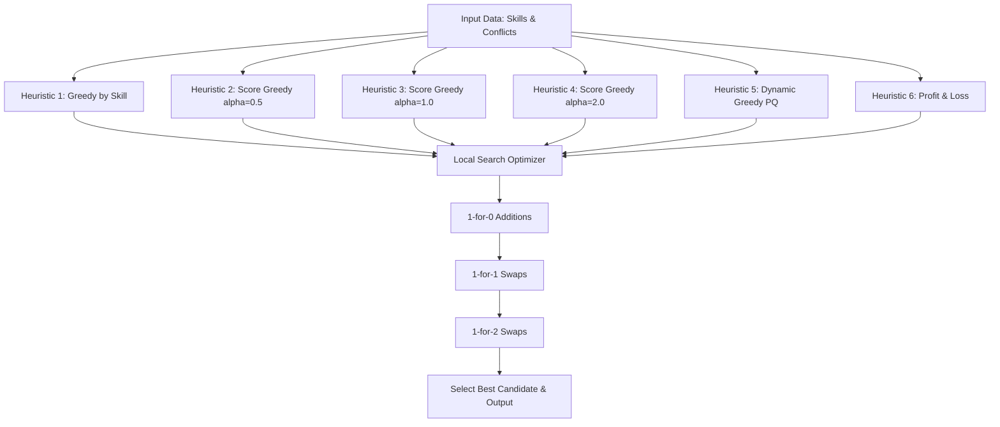

# 🚀 Hackathon Squad Selector
> A high-performance, advanced solver for selecting the ultimate, conflict-free dream team of coders under constraints.

---

## 🧩 The Challenge
In a hackathon, you have $N$ talented coders, each with a specific **skill rating** $S_i$. However, some coders have **conflicts** with one another. If two selected coders have a conflict, team synergy drops to zero, and the squad fails. 

Your mission is to **select a subset of coders** such that:
1. **Absolutely no two selected coders have a conflict** (conflict-free).
2. The **sum of skill ratings** of the selected coders is **maximized**.

Mathematically, this is the classic **Maximum Weight Independent Set (MWIS)** problem on general graphs—a notorious **NP-Hard** optimization problem. This project implements a cutting-edge **Multi-Heuristic Ensemble** and **Iterative Local Search** solver capable of handling huge inputs ($N = 2 \times 10^5$) and finding optimal or near-optimal teams in **milliseconds**.

---

## 📊 Problem Specifications & Constraints

### Constraints
* $1 \le N \le 2 \times 10^5$ (Number of coders)
* $0 \le M \le \frac{N(N-1)}{2}$ (Number of conflicts)
* $1 \le S_i \le 10^9$ (Coder skill rating)
* $1 \le u, v \le N, u \neq v$ (Conflicts are 1-based, distinct, undirected edges)

### Input Format
```text
N M
S1 S2 S3 ... SN
u1 v1
u2 v2
...
uM vM
```

### Output Format
```text
[Maximum Sum of Skill Ratings]
[1-based Indices of Selected Coders in Ascending Order]
```

---

## 🧠 Solver Architecture & Algorithms

To guarantee the highest possible score, the solver runs **six distinct heuristic engines** in parallel, feeds their outputs to an **Iterative Local Search Optimizer**, and picks the highest-scoring candidate.



### 1. ⚔️ The Multi-Heuristic Engine
* **Standard Greedy (by Skill):** Iteratively drafts the highest-skilled available coder and blocks their conflicting peers.
* **Static Score Greedy (Degree-Discounted):** Sorts coders using a weighted ratio:
  $$\text{Score}(u) = \frac{S_u}{1 + \alpha \times \text{deg}(u)}$$
  We evaluate $\alpha \in \{0.5, 1.0, 2.0\}$ to balance skill against connectivity.
* **Dynamic Greedy (Priority Queue):** Dynamically updates degree scores as neighbors are blocked, selecting the best localized weight-to-degree ratios.
* **Profit & Loss (P&L) Greedy:** Sorts coders by their net gain (own skill minus the sum of conflicting neighbors' skills) to avoid drafting high-conflict blockers.

### 2. ⚡ The Local Search Optimizer (The Secret Weapon)
After drafting an initial squad, the optimizer runs iterative passes of local swaps:
* **1-for-0 Swaps:** Scans and drafts any coders who have no conflicts with the current squad.
* **1-for-1 Swaps:** Replaces an active coder $v$ with a drafted coder $u$ if $S_u > S_v$ and $v$ was the only conflict holding $u$ back.
* **1-for-2 Swaps:** Replaces two active coders $n_1, n_2$ with $u$ if $S_u > S_{n_1} + S_{n_2}$ and they were the only conflicts holding $u$ back.

---

## 🛠️ How to Compile & Run

Compiling is straightforward using any modern C++ compiler supporting C++11 or later.

### Compilation
```bash
g++ -O3 main.cpp -o main.exe
```

### Execution (Redirecting Input)
```bash
.\main.exe < input.txt
```

### Sample Output (Test Case 2)
Input:
```text
3 2
100 60 60
1 2
1 3
```
Output:
```text
120
2 3
```

---

## 📂 Project Structure
```text
📂 Hackathon-Squad
 ├── 📁 .vscode          # Editor & task configurations
 ├── 📄 input.txt        # Comprehensive testing datasets
 ├── 📄 main.cpp         # Unified, comment-free, optimized MWIS solver
 └── 📄 README.md        # This premium project manual
```

---
*Created with 💙 for the Hackathon Squad Selection Challenge.*
